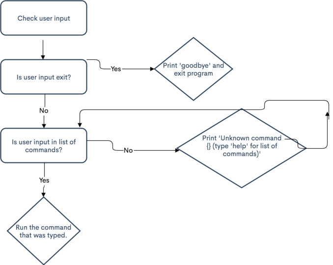

## Table of Contents
1. [How-to Setup Environment](#how-to-setup-environment)
    - [Goals](#goals)
        - [Visitor Goals](#visitor-goals)
        - [Business Goals](#business-goals)
        - [Solo Traveller Handbook Goals](#solo-traveller-handbook-goals)
2. [How to build application](#how-to-build-application)
    - [Handlers](#handlers)
    - [Start](#start)
    - [Login](#login)
    - [Logout](#logout)
    - [Add](#add)
    - [Search](#search)
    - [List](#list)
    - [Clear](#clear)
    - [Help](#help)
    - [Exit](#exit)


3. [How to Use Application](#information-architecture)

# How-to Setup Environment

# How-to Build Application

Firstly, you will need to import your operating system with the following code:

```
from os import system
```

Next, you must define the class. This will contain all the functions you will later use for your application.

```
class ExpensesApp(object):

```

## Start


## Handlers

The application will have the following commands. 

- Login
- Logout
- Add
- Search
- List
- Clear
- Help
- Exit

To create the handlers that will initiate these commands in the program, write the following code in the class Expenses(App). Make sure to include the correct indentation, as specified in section one on setting up the environment:

```
def __init__(self):
		self._commands = {
			"login": self._cmd_log_in,
			"logout": self._cmd_log_out,
			"add": self._cmd_add_expense,
			"list": self._cmd_list_expenses,
			"search": self._cmd_search_expenses,
			"clear": self._cmd_clear,
			"help": self._cmd_list_commands,
			"exit": self._cmd_exit,
		}

		# Expenses database
		self._db = []

		# Current username
		self._username = None

		# Exit flag
		self._exit = False

```

## Start

Below is a diagram that outlines the flow of the program.



The logic is as follows:

- The program reads the command.
- If the command is from the handler list, it is executed.
- If the command is not from the handler list, the program specified that it is an unknown command and suggests that the user type 'help' to see a list of existing commands.

To execute this logic, write the following code:

```
def start(self):

		while not self._exit:
			# Read command and agruments from the user input
			user_input = input("cmd> ")
			try:
				command, *args = user_input.split()
			except:
				continue

			# React to an unknown command
			if command not in self._commands:
				print("Unknown command {} (type 'help' for the list of commands)".format(command))
				continue

			# Run command
			self._commands[command](*args)

		print("Goodbye!")
```


# How-to Use Application
