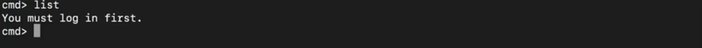

## Table of Contents
1. [How-to Setup Environment](#how-to-setup-environment)
2. [How to build application](#how-to-build-application)
    - [Setup](#setup)
    - [Handlers](#handlers)
    - [Start](#start)
    - [Login](#login)
    - [Logout](#logout)
    - [Add](#add)
    - [Search](#search)
    - [List](#list)
    - [Clear](#clear)
    - [Help](#help)
    - [Exit](#exit)
    - [Initialise App](#initialise-app)
3. [How to Use Application](#how-to-use-application)

# How-to Setup Environment

# How-to Build Application

## Setup

Firstly, you will need to import your operating system with the following code:

```
from os import system
```

Next, you must define the class. This will contain all the functions you will later use for your application.

```
class ExpensesApp(object):

```


## Handlers

The application will have the following commands. 

- Login
- Logout
- Add
- Search
- List
- Clear
- Help
- Exit

To create the handlers that will initiate these commands in the program, write the following code in the class Expenses(App). Make sure to include the correct indentation, as specified in section one on setting up the environment:

```
def __init__(self):
		self._commands = {
			"login": self._cmd_log_in,
			"logout": self._cmd_log_out,
			"add": self._cmd_add_expense,
			"list": self._cmd_list_expenses,
			"search": self._cmd_search_expenses,
			"clear": self._cmd_clear,
			"help": self._cmd_list_commands,
			"exit": self._cmd_exit,
		}

		# Expenses database
		self._db = []

		# Current username
		self._username = None

		# Exit flag
		self._exit = False

```

## Start

Below is a diagram that outlines the main program loop.


The logic is as follows:

- The program reads the command.
- If the command is from the handler list, it is executed.
- If the command is not from the handler list, the program specifies that it is an unknown command. It then suggests that the user type 'help' to see a list of existing commands.

To execute this loop, write the following code:

```
def start(self):

		while not self._exit:
			# Read command and agruments from the user input
			user_input = input("cmd> ")
			try:
				command, *args = user_input.split()
			except:
				continue

			# React to an unknown command
			if command not in self._commands:
				print("Unknown command {} (type 'help' for the list of commands)".format(command))
				continue

			# Run command
			self._commands[command](*args)

		print("Goodbye!")
```
The start function also allows the user to type 'exit' to leave the program.

---

## Login

To use other expense management commands, the user must login. This is the flow for logging in:


The program checks the inputted name, and prints a confirmation message.

If nothing is entered, it prints the usage.

The following code is needed for the login:

```
def _cmd_log_in(self, username=None, *args):
		"""
			Log in command.
			Prerequisite to other expenses management commands
		"""
		if username is None:
			print("usage: login <name>")
			return
		self._username = username
		print("Logged in as {}".format(username))
```

## Login check

This function is necessary to check whether the user is logged in when using other commands that require login.

It will be referenced in other functions. It is therefore important for the smooth running of the program.

The code for this function is as follows:

```
def _is_logged_in(self):
		"""
			Returns True if user is logged in
		"""
		return self._username is not None

```

## Logout

This logs out the user, and prints a confirmation message to tell the user he/she has successfully logged out.

```
def _cmd_log_out(self):
		"""
			Logs out user
		"""
		print("User logged out")

```

## Add

This allows the user to add an expense. It takes two arguments, the name and the amount.


- Firstly, the program checks if the user is logged in using the _is_logged_in function defined earlier.
- If the user is not logged in, the user is told 'You must login first'.
- If the user is logged in, they can add a <name> and <amount>, then hit enter. This adds the data to the database.
- Once the user hits enter, they get a confirmation message - 'Added new expense'.
- If there are any errors, the program prints the usage.

Below is the code for this function:

```
def _cmd_add_expense(self, name=None, amount=None, *args):
		"""
			Adds an expense for the logged in user
		"""
		if not self._is_logged_in():
			print("You must log in first.")
			return

		try:
			f_amount = float(amount)

			# Add expense to the database
			self._db.append({
				"name": name,
				"amount": f_amount,
				"username": self._username,
			})
			print("Added new expense.")
		except Exception as e:
			# If there was an exception, print usage
			print("usage: add <name> <amount> [<group>]")

```
## Search

This searches for the expenses of the logged in user by name. 


- Firstly, the program checks if the user is logged in using the _is_logged_in function defined earlier.
- Next it checks the user input.
- If user input isn't in the database, it prints the empty rows 'name' and 'amount'.
- Then, it skips other user rows and only focuses on the logged in user.
- It skips all rows that don't contain the name that was inputted from the particular user.
- Once it has found the 'name' (or 'name's) that match with the input, it prints them all under the headers 'name' and 'amount'.
- If there are any errors, the program prints the usage.

The following is the code needed to implement this command:

```
def _cmd_search_expenses(self, searchstring=None, *args):
		"""
			Searches expenses of the logged in user by their name
		"""

		if not self._is_logged_in():
			print("You must log in first.")
			return

		try:
			# Validate arguments
			if not isinstance(searchstring, str):
				raise

			# Display header
			print("name\tamount")

			# Display rows
			for row in self._db:
				# Skip other users' rows
				if row["username"] != self._username:
					continue

				# Skip records that don't contain the searchstring
				if searchstring not in row["name"]:
					continue

				# Print the row
				print("{}\t{}".format(
					row["name"],
					row["amount"],
				))
		except:
			# If there was an exception, print usage
			print("usage: search <searchstring>")

	
```


## List

This command lists all the expenses of the logged in user.


- Firstly, the program checks if the user is logged in using the _is_logged_in function defined earlier.
- Then the program prints the headers 'name' and 'amount'.
- Next the program checks the rows that match the username. 
- If a row doesn't match the username, it skips it.
- Finally it prints the rows that match the username under the headers.
- If there are any errors, the program prints the usage.

The code for this is as follows:

```
def _cmd_list_expenses(self, *args):
		"""
			Displays expenses of the logged in user
		"""

		if not self._is_logged_in():
			print("You must log in first.")
			return

		try:
			# Display header
			print("name\tamount")

			# Display rows
			for row in self._db:
				# Skip other users' rows
				if row["username"] != self._username:
					continue

				# Print the row
				print("{}\t{}".format(
					row["name"],
					row["amount"],
				))
		except:
			# If there was an exception, print usage
			print("usage: list")

```

## Clear

This command clears the screen, and is written like so:

```
def _cmd_clear(self):
		"""
			Clears the screen
		"""
		system('clear')
```


## Help

The help command lists all the commands for the user, in case they need a reminder about functionality.

Here is the code for this:

```
def _cmd_list_commands(self):
		"""
			Prints all avaliable commands
		"""
		for command in self._commands:
			print(command)
```

## Exit

The exit command allows the user to exit the program. There is an initial exit flag that is set to False when the program is initialised (see handlers). This command sets it to True.

```
def _cmd_exit(self):
		"""
			Sets the exit flag to true
		"""
		self._exit = True

```

## Initialise App

The final step is to initialise the application. This is placed at the **bottom** of the file, and **outside** of the class ExpensesApp.

Like so:

```
if __name__ == '__main__':
	app = ExpensesApp()
	app.start()
```


# How-to Use Application

To use the application, first you need to run python in the terminal:


You will then get prompted for a command. Type one of the commands from the list specified in the how to build section. For example:


After you have typed the help command, hit enter. The program will print a list of all the commands you can use.


The following section will demonstrate how each of these commands can be used.

## Login

To use the search, list and add command, it is necessary to be logged in. Not being logged in returns a login error message:



To login, type the login command followed by your username.


This will return a login success message.


Now you can proceed to use more complex commands.

## Add

The add command adds expenses to the database. If you type add, the program will show you the usage:


To use the add command, you therefore need to type 'add' and then follow it by a 'name' and 'amount' separated by a space.

Once you hit enter, you will receive a success message.


## List

To see all items added to the database by the user that is logged in, you use the list command. You simply need to type list, and it will display all entries. If there are no entries, it will display an empty name and amount header.


## Search

The search command allows you to search for all entries with the same name. You must type the command, followed by the name and hit enter. It will then display all the entries for you in a list.


## Clear

The clear command will clear the terminal.

## Logout

The logout command logs you out of your current user. This way you can login as a new user and add different expenses.


## Exit

Using this command you exit the program entirely.


